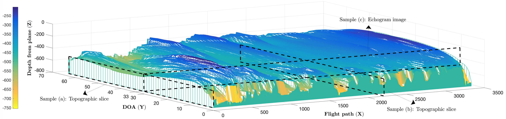

# Automatic Estimation of Ice Bottom Surfaces from Radar Imagery

## Introduction

This is an implementation for our ICIP 2017 paper "[`Automatic Estimation of Ice Bottom Surfaces from Radar Imagery`](https://arxiv.org/pdf/1712.07758.pdf)".

## Citations

If you are using the code provided here in a publication, please cite our papers:

    @inproceedings{icesurface2017icip, 
        title = {Automatic estimation of ice bottom surfaces from radar imagery},
        author = {Mingze Xu and David J. Crandall and Geoffrey C. Fox and John D. Paden},
        booktitle = {IEEE International Conference on Image Processing (ICIP)},
        year = {2017}
    }

